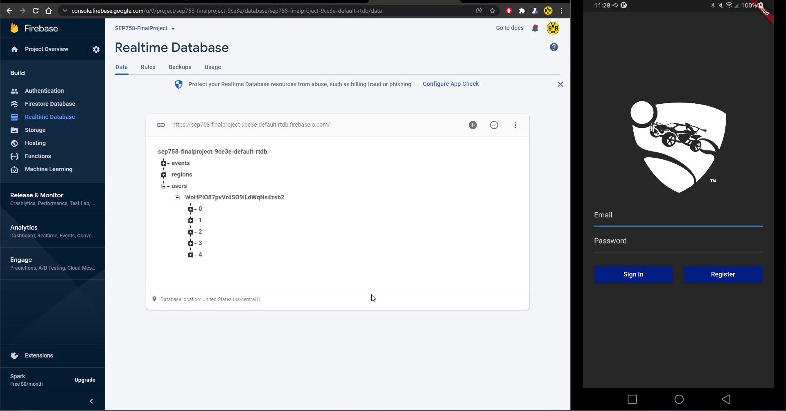
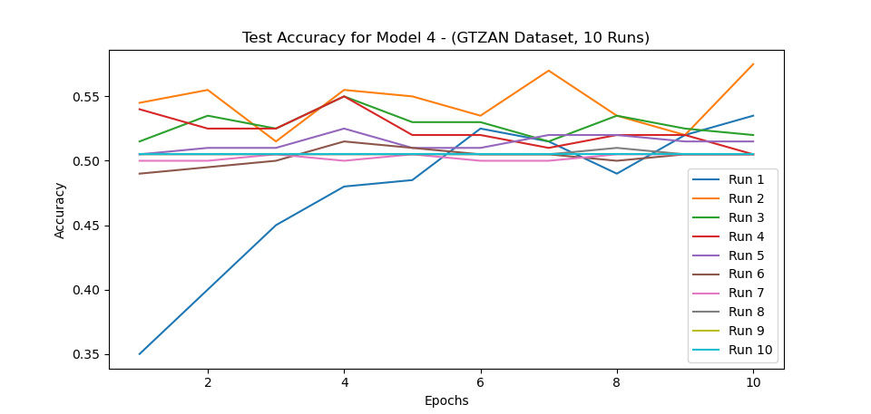
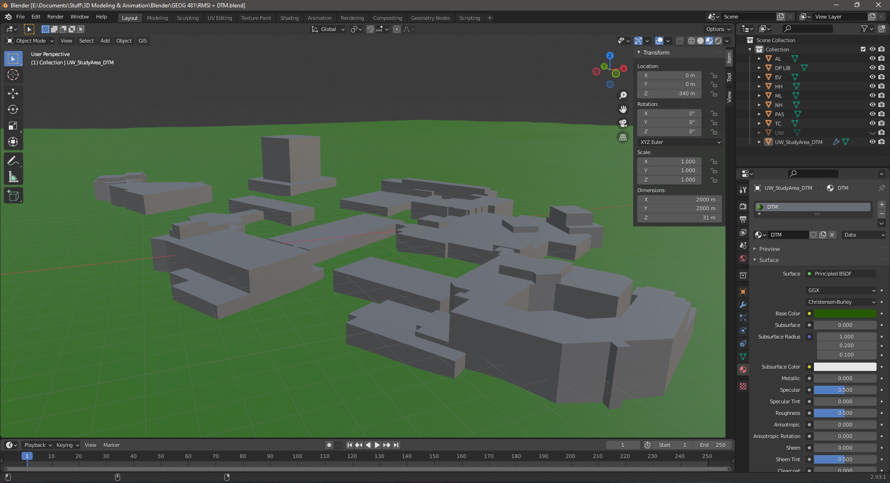
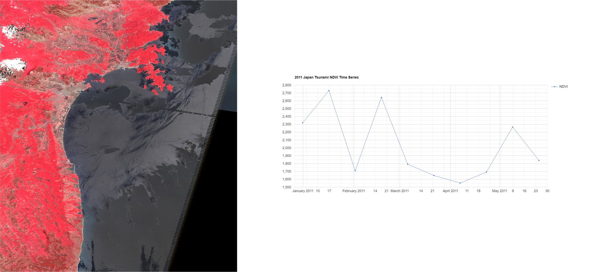
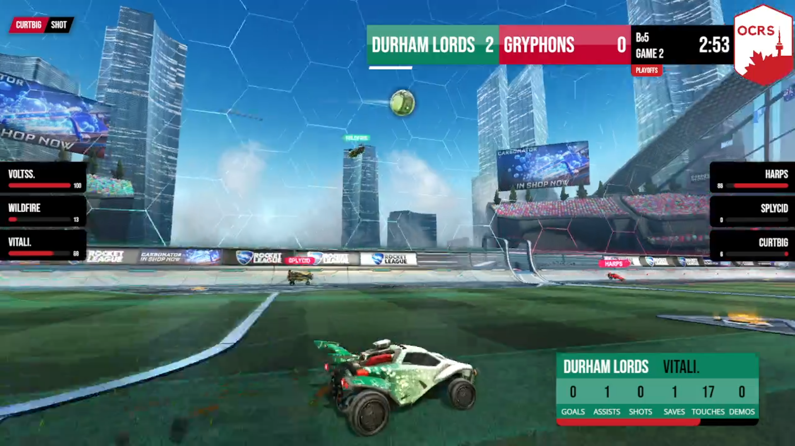

# Recent Projects

## Prototyping Mobile Applications - Final Project (McMaster University)

- Rocket League Esports Companion App
- Built using Dart and Flutter
- Leverages Firestore Authentication and Realtime Database

## Computational Neuroscience - Final Project (University of Waterloo)

- Exploring Music Genre Classification using Dense Neural Networks
- CNN models created using Tensorflow
- Trained on GTZAN dataset and tested on custom dataset

## Advanced Geographic Information Systems - Final Project (University of Waterloo)

- Rainfall Pooling Comparison between QGIS and Unity 3D Game Engine
- Fluid simulation created in Unity using particle system and C# scripting
- 3D models of UWaterloo campus generated using [Blender GIS](https://github.com/domlysz/BlenderGIS) plugin by importing ESRI shapefiles and DTM rasters

## Advanced Remote Sensing - Final Project (University of Waterloo)

- Quantifying Tsunamis using FCC/NDVI and Statistical Analyses
- False colour composite and normalized difference vegetation index imagery generated using Google Earth Engine JavaScript API
- Time series graphs created to determine long-term effects of tsunamis on local vegetation

## [Ontario Collegiate Rocket Soccer (OCRS) Twitch Broadcast Overlay](https://github.com/AlbertPangilinan/OCRS)

- Used in the live broadcast of [OCRS](https://www.twitch.tv/ontariocrs) Season 3
- Retrieves real-time game events through web socket connection to [SOS Plugin](https://gitlab.com/bakkesplugins/sos/sos-plugin) for [BakkesMod](https://www.bakkesmod.com/)
- Works seamlessly with [OBS Studio](https://obsproject.com/) streaming software

