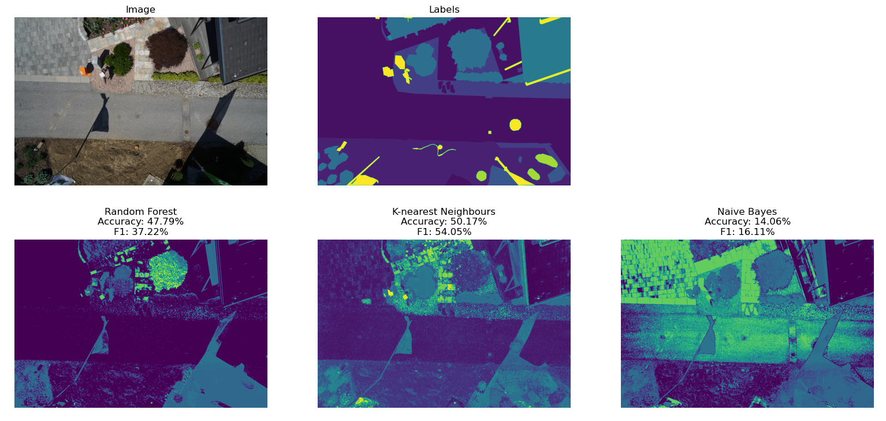
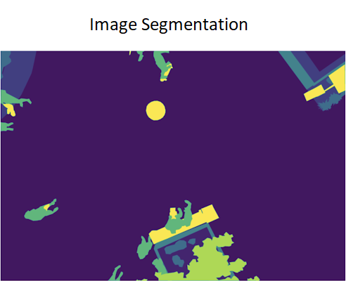
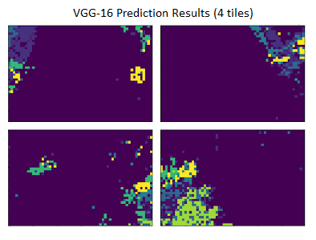
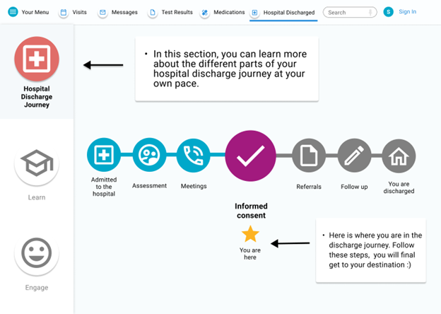
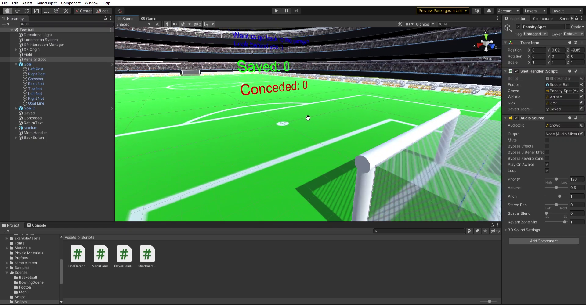
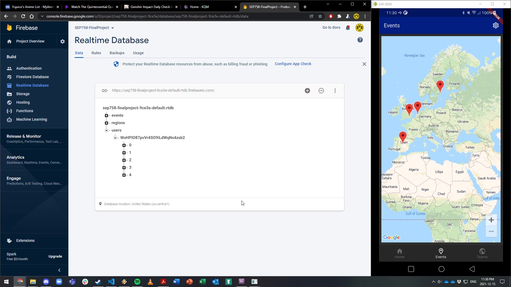
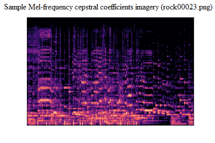
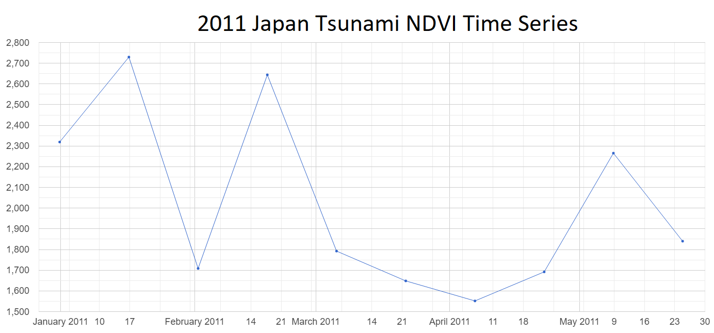

# Recent Projects

## [Deep Learning - Final Project (McMaster University)](https://github.com/AlbertPangilinan/SEP740)

- Aerial Perspective Object Detection 
- Utilizing [Aerial Semantic Segmentation Drone Dataset](https://www.tugraz.at/index.php?id=22387)
- Semantic image segmentation using machine learning (random forest, KNN, naive Bayes) and deep learning (CNN: VGG-16)

## Master of Engineering Design - Capstone Project (McMaster University)

- Interactive Tool for an Effective Discharge from Alternate Level of Care
- Devised a software application UI of an interactive tool to strengthen patient and family engagement in the ALC decision making process
- Collaborated with healthcare professionals from St. Joseph's Healthcare Hamilton
- Conducted patient interviews and user feasability tests to gain feedback for UI prototype iterations
- Gained practical experience with industry technologies and processes while applying design thinking principles to a real world scenario

## Augmented, Virtual, and Mixed Reality Development - Final Project (McMaster University)

- Virtual Reality Sports Game
- Features soccer (football) goalkeeper, bowling, and basketball game modes
- Developed with Unity for Oculus Quest 2 and leverages Unity XR

## Prototyping Web and Mobile Applications - Final Project (McMaster University)

### Rocket League Esports Companion Apps

- [Web app](https://github.com/AlbertPangilinan/SEP759) built using Ruby/Ruby on Rails
- Utilizes [Devise](https://github.com/heartcombo/devise) for user authentication and authorization
- Handles user reading and writing of data through JSON API

- [Mobile app](https://github.com/AlbertPangilinan/SEP758) built using Dart and Flutter
- Leverages Firestore Authentication and Realtime Database
- Integrates Google Maps API for location-based functionality

## [Computational Neuroscience - Final Project (University of Waterloo)](https://github.com/AlbertPangilinan/SYDE552)

- Exploring Music Genre Classification using Dense Neural Networks
- CNN models created using Tensorflow
- Trained on [GTZAN Dataset](https://www.tensorflow.org/datasets/catalog/gtzan) and tested on custom dataset

## Advanced Geographic Information Systems - Research Project, 3D GIS Modelling and Simulation (University of Waterloo)

- Rainfall Pooling Comparison between QGIS and Unity 3D Game Engine
- Fluid simulation created in Unity using particle system and C# scripting
- 3D models of UWaterloo campus generated using [Blender GIS](https://github.com/domlysz/BlenderGIS) plugin by importing ESRI shapefiles and DTM rasters

<blockquote class="imgur-embed-pub" lang="en" data-id="e7mORGy"><a href="https://imgur.com/e7mORGy">View post on imgur.com</a></blockquote>

## Advanced Remote Sensing - Research Project, Tsunami Quantification and Analysis (University of Waterloo)

- Quantifying Tsunamis using FCC/NDVI and Statistical Analyses
- False colour composite and normalized difference vegetation index imagery generated using Google Earth Engine JavaScript API
- Time series graphs created to determine long-term effects of tsunamis on local vegetation

## [Canadian Collegiate Rocket Soccer (CCRS) Twitch Broadcast Overlay](https://github.com/AlbertPangilinan/CCRS)

- Used in the live broadcast of [CCRS](https://www.twitch.tv/canadiancrs)
- Retrieves real-time game events through web socket connection to [SOS Plugin](https://gitlab.com/bakkesplugins/sos/sos-plugin) for [BakkesMod](https://www.bakkesmod.com/)
- Works seamlessly with [OBS Studio](https://obsproject.com/) streaming software
- Rendered stream graphics in Unreal Engine 4 using [Psyonix Hype Chamber](https://www.unrealengine.com/en-US/spotlights/enter-the-rocket-league-hype-chamber-a-new-sample-for-broadcast-and-live-events)

<blockquote class="imgur-embed-pub" lang="en" data-id="xIvc2RP"><a href="https://imgur.com/xIvc2RP">View post on imgur.com</a></blockquote>

